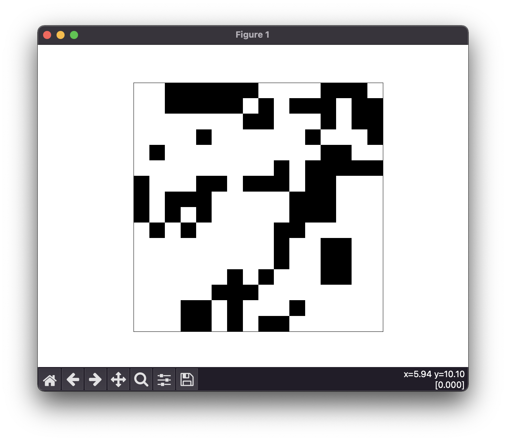

# Game of Life
An implementation of [Conway's Game of Life](https://en.wikipedia.org/wiki/Conway%27s_Game_of_Life), using `matplotlib` for graphics.

### Features
 - Configurable grid size and number of steps
 - GUI provided with `matplotlib` with full step-through support

### Usage
With a decently modern Python, Git, and Poetry (`pip install poetry`), run the following commands:
```
git clone https://github.com/morgzxd/GameOfLife.git
cd GameOfLife
poetry install
poetry run python main.py
``` 
